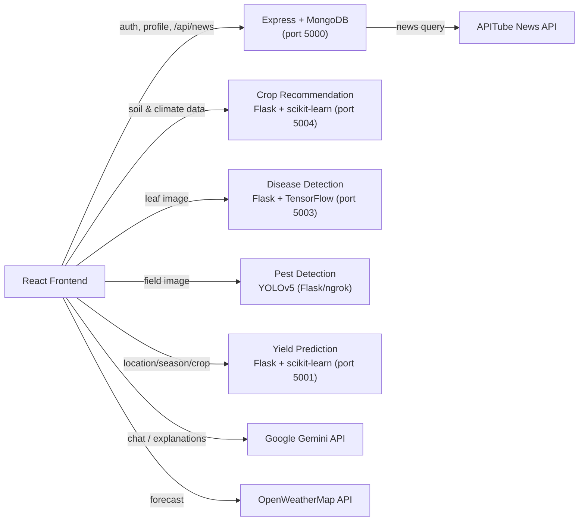

<div align="center">


# 🌾 FarmWise - AI

**A full-stack smart farming platform that helps smallholder farmers make better, data-driven decisions.**

[](https://reactjs.org/)
[](https://nodejs.org/)
[](https://www.mongodb.com/)
[](https://flask.palletsprojects.com/)
[](https://scikit-learn.org/)
[](https://www.tensorflow.org/)
[](https://github.com/ultralytics/yolov5)
[](https://ai.google.dev/)

</div>

---

## 📖 Overview

FarmWise - AI is a full-stack web platform built to help **smallholder farmers** — a large share of whom in India speak regional languages and lack easy access to agronomic expertise — make better decisions about what to grow, how to protect it, and how much to expect from a harvest.

The platform combines four independent **machine learning models**, a **generative AI assistant** (Google Gemini), live **weather** and **agriculture news** data, and **multi-language support** (English, Hindi, Telugu, Marathi, Bengali) into a single, easy-to-use interface — so a farmer can go from "what should I plant?" to "is my crop diseased?" to "what yield can I expect?" without needing separate tools or technical expertise.

## ✨ Key Features

| Feature | Description |
|---|---|
| 🌱 **Crop Recommendation** | Enter soil nutrients (N, P, K), temperature, humidity, pH, and rainfall — a Random Forest model suggests the top 3 best-suited crops, and Gemini generates a natural-language explanation plus fertilizer recommendations. |
| 🍃 **Plant Disease Detection** | Upload a photo of a leaf and a CNN classifies it into one of 38 disease categories across 14+ crop types (apple, tomato, corn, grape, potato, etc.), with an AI-generated summary of the cause and cure. |
| 🐛 **Pest Detection** | Upload a field/crop image and a YOLOv5 object-detection model identifies which pests are present. |
| 📈 **Crop Yield Prediction** | Predicts expected yield using a Random Forest Regressor trained on historical state/district/season/crop/area data. |
| 🤖 **AI Farming Assistant** | A chatbot powered by Google Gemini answers open-ended farming questions in short, actionable points. |
| ⛅ **Weather Forecast** | 5-day weather forecast for the farmer's region via OpenWeatherMap. |
| 📰 **Agriculture News Feed** | Live, curated agriculture news carousel. |
| 🌐 **Multi-language Support** | Full UI and AI-response translation into English, Hindi, Telugu, Marathi, and Bengali via i18next + Google Cloud Translation. |
| 🔐 **Authentication** | Signup/login/profile system; crop, disease, yield, and pest tools are gated behind login. |

## 🏗️ Tech Stack

**Frontend**
- React 18 (Create React App), React Router
- Tailwind CSS
- i18next / react-i18next (internationalization)
- Axios, Swiper.js

**Backend**
- Node.js + Express.js
- MongoDB + Mongoose (user accounts & profiles)

**Machine Learning Microservices** *(each is an independent Flask API)*
- **Crop Recommendation** — Python, Flask, scikit-learn (`RandomForestClassifier`)
- **Crop Yield Prediction** — Python, Flask, scikit-learn (`RandomForestRegressor`)
- **Plant Disease Detection** — Python, Flask, TensorFlow/Keras CNN (38-class image classifier)
- **Pest Detection** — YOLOv5 (Ultralytics/PyTorch), trained in a Colab notebook, served via Flask

**AI & External APIs**
- Google Gemini API (`gemini-1.5-flash`) — conversational assistant & AI-generated explanations
- Google Cloud Translation API — translates AI responses into the selected language
- OpenWeatherMap API — weather forecasts
- APITube — agriculture news feed

## 🧩 Architecture

The app is composed of a React SPA talking to an Express API (auth + news proxy) and several independent ML microservices, each exposing its own REST endpoint:



## 📁 Project Structure

```
FarmWise.Ai/
├── Backend/                     # Express API — auth, profile, news proxy
│   ├── index.js                 # Server entry point
│   └── Sup.js                   # Mongoose user schema
│
├── Frontend/                    # React application
│   └── src/
│       ├── components/          # Header, Footer, Chatbot, homepage sections
│       └── pages/
│           ├── crop/            # Crop recommendation UI
│           ├── disease/         # Disease detection UI
│           ├── pest/            # Pest detection UI
│           ├── yeild/           # Yield prediction UI
│           ├── auth/            # Signup / login
│           ├── Weather.js
│           └── NewsFeed.js
│
└── Models/                      # ML training scripts & Flask model servers
    ├── Crop_Recommendation/
    ├── Crop_Yield_Prediction/
    ├── Disease Prediction/
    └── Pest_detection/          # YOLOv5 notebook + trained weights (best.pt)
```

## 🚀 Getting Started

### Prerequisites
- [Node.js](https://nodejs.org/) (v16+) & npm
- [Python](https://www.python.org/) 3.9+
- A [MongoDB Atlas](https://www.mongodb.com/atlas) cluster (or local MongoDB)
- API keys for: [Google Gemini](https://ai.google.dev/), [Google Cloud Translation](https://cloud.google.com/translate), [OpenWeatherMap](https://openweathermap.org/api), [APITube](https://apitube.io/)

### 1. Clone the repo
```bash
git clone https://github.com/eeshasreepadamata/FarmWise.Ai.git
cd FarmWise.Ai
```

### 2. Backend setup
```bash
cd Backend
npm install
```
Create a `.env` file in `Backend/`:
```env
MONGO_URI=your_mongodb_connection_string
NEWS_API_KEY=your_apitube_api_key
PORT=5000
```
```bash
npm start
```

### 3. Frontend setup
```bash
cd Frontend
npm install
```
Create a `.env` file in `Frontend/`:
```env
REACT_APP_GEMINI_API_KEY=your_gemini_api_key
REACT_APP_TRANSLATE_API_KEY=your_google_translate_api_key
REACT_APP_WEATHER_API_KEY=your_openweathermap_api_key
```
```bash
npm start
```
Runs on `http://localhost:3000`.

### 4. ML model services
Each model is a standalone Flask app — install dependencies and run each in its own terminal.

```bash
# Crop Recommendation → http://localhost:5004
cd Models/Crop_Recommendation
pip install flask flask-cors pandas numpy scikit-learn
python Recommendation_Model.py

# Crop Yield Prediction → http://localhost:5001
cd Models/Crop_Yield_Prediction
pip install flask flask-cors pandas numpy scikit-learn joblib
python YeildPrediction_Model.py

# Disease Prediction → http://localhost:5003
cd "Models/Disease Prediction"
pip install flask flask-cors tensorflow pillow numpy
python testsmaple.py   # requires plant_disease_prediction_model.h5

# Pest Detection (YOLOv5)
# Trained and served from Models/Pest_detection/PestDetection.ipynb (Colab).
# Exposes an ngrok URL that the frontend's pest detection page points to.
```

> **Note:** The disease and pest detection services load pre-trained model weights (`plant_disease_prediction_model.h5` and `best.pt`) that need to be present locally / generated by running the corresponding notebook.

## 🔌 API Endpoints

| Service | Method | Endpoint | Purpose |
|---|---|---|---|
| Backend | `POST` | `/Sup` | Register a new user |
| Backend | `POST` | `/login` | Authenticate a user |
| Backend | `GET` | `/profile` | Fetch user profile by email |
| Backend | `GET` | `/api/news` | Proxy agriculture news |
| Crop Recommendation | `POST` | `/recommend-crop` | Top-3 crop suggestions |
| Crop Yield Prediction | `POST` | `/predict-crop-yield` | Predicted yield |
| Disease Detection | `POST` | `/predict` | Disease classification from image |
| Pest Detection | `POST` | `/detect` | Pest identification from image |

## 🖼️ Screenshots

*(Add a few screenshots or a short demo GIF here — the homepage, the crop recommendation form, and a disease-detection result all make good choices for a resume README.)*

## 🔮 Future Enhancements
- Move all ML services behind a single API gateway
- Containerize services with Docker for easier setup
- Deploy models to the cloud instead of local/ngrok hosting
- Add automated tests and CI

## 👩‍💻 Author
**Eesha Sree Padamata** — [GitHub](https://github.com/eeshasreepadamata)
